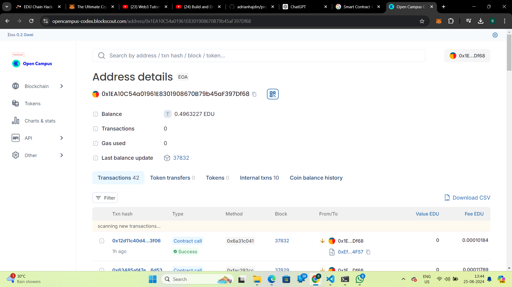

# Smart Contract-Based Scholarship System

## Vision

The **Smart Contract-Based Scholarship System** aims to revolutionize the scholarship application and distribution process by leveraging blockchain technology. Our goal is to create a decentralized platform that ensures transparency, fairness, and efficiency in awarding scholarships. By automating the application and distribution process through smart contracts, we seek to eliminate manual errors, reduce administrative overhead, and provide a trustworthy system for both applicants and administrators.

## Project Features

- **Decentralized Application**: A blockchain-based platform that automates the scholarship application and approval process.
- **Smart Contracts**: Automated smart contracts handle the scholarship distribution based on predefined criteria, ensuring transparency and fairness.
- **React Frontend**: A user-friendly frontend developed using React for easy interaction with the system.
- **Secure Transactions**: Utilizes blockchain technology to secure and verify transactions and contract execution.
- **Transparent Process**: All scholarship transactions and applications are recorded on the blockchain, providing a transparent and immutable record.
- **Automated Workflow**: Streamlined application review and approval process, reducing manual intervention and errors.

## Future Scope

- **Enhanced User Interface**: Implement advanced UI/UX features to improve user interaction and experience.
- **Integration with Educational Institutions**: Collaborate with educational institutions for seamless integration and automated verification of student credentials.
- **Scalability**: Expand the system to support a larger number of scholarships and applications.
- **Multi-Chain Support**: Explore the possibility of integrating with other blockchain networks for broader accessibility.
- **AI Integration**: Incorporate AI algorithms to assess scholarship applications and provide recommendations based on various criteria.

## Project Structure

- **Frontend**
  - `src/`: Contains the source code for the React application.
    - `components/`: React components for the user interface.
    - `pages/`: Pages and views of the application.
    - `utils/`: Utility functions and helpers.
    - `App.js`: Main application file.
    - `index.js`: Entry point of the React application.
- **Smart Contracts**
  - `contracts/`: Contains the smart contract source code.
    - `Scholarship.sol`: Smart contract for handling scholarship applications and distributions.
  - `scripts/`: Deployment and interaction scripts for smart contracts.
- **Configuration**
  - `hardhat.config.js`: Configuration file for Hardhat.
  - `package.json`: Node.js package configuration.
- **Documentation**
  - `README.md`: Project documentation.
- **Miscellaneous**
  - `.gitignore`: Git ignore file.
  - `deploy.js`: Script for deploying contracts.
  - `test/`: Contains test cases for smart contracts and frontend.

## Developer Details

- **Name**: Bhoomi
- **Role**: Lead Developer
- **Email**: b23255@students.iitmandi.ac.in

## Acknowledgments

- Thanks to the blockchain and web3 communities for their invaluable resources and support.
- Special thanks to the contributors and collaborators who have provided feedback and assistance throughout the development process.
